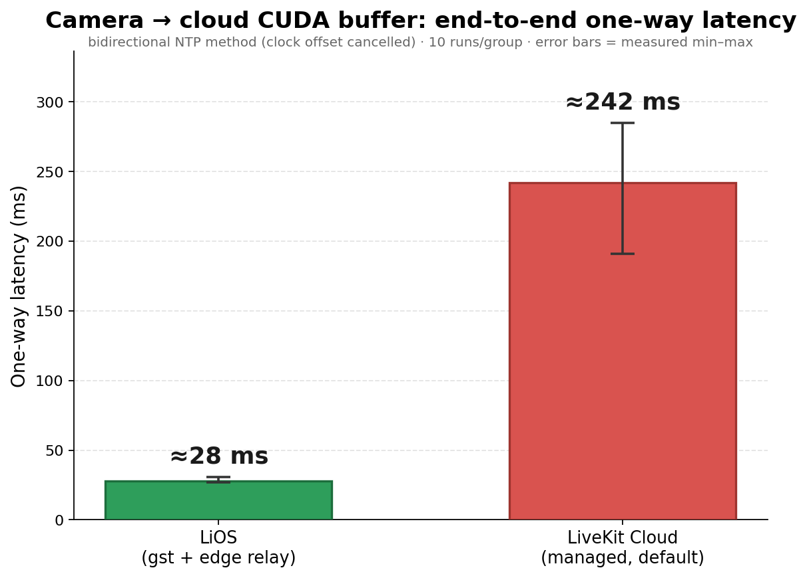
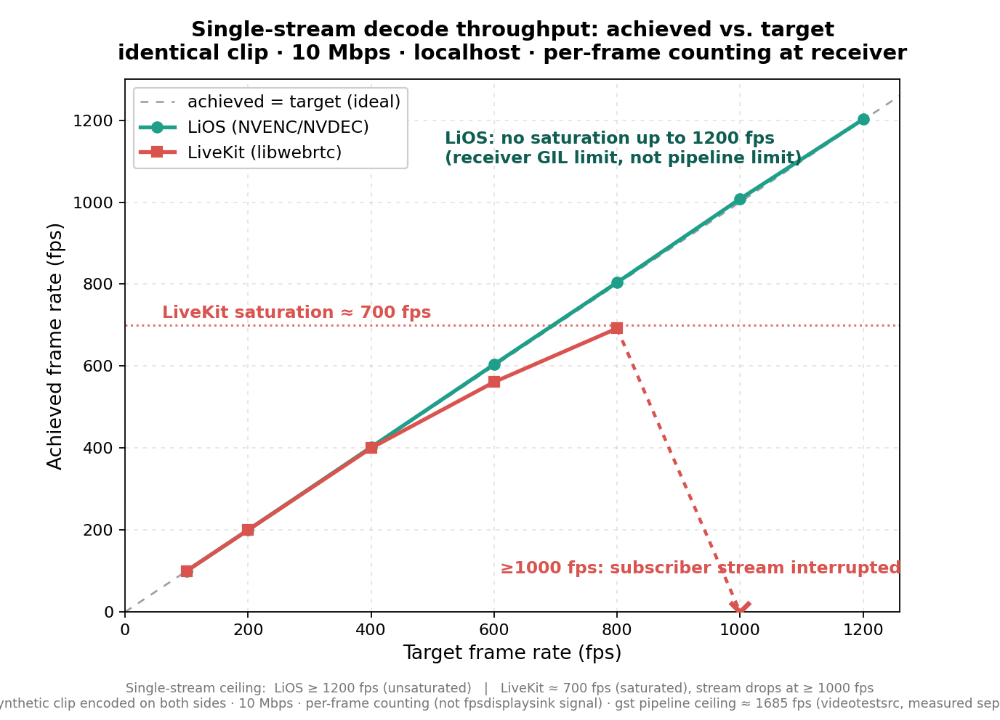
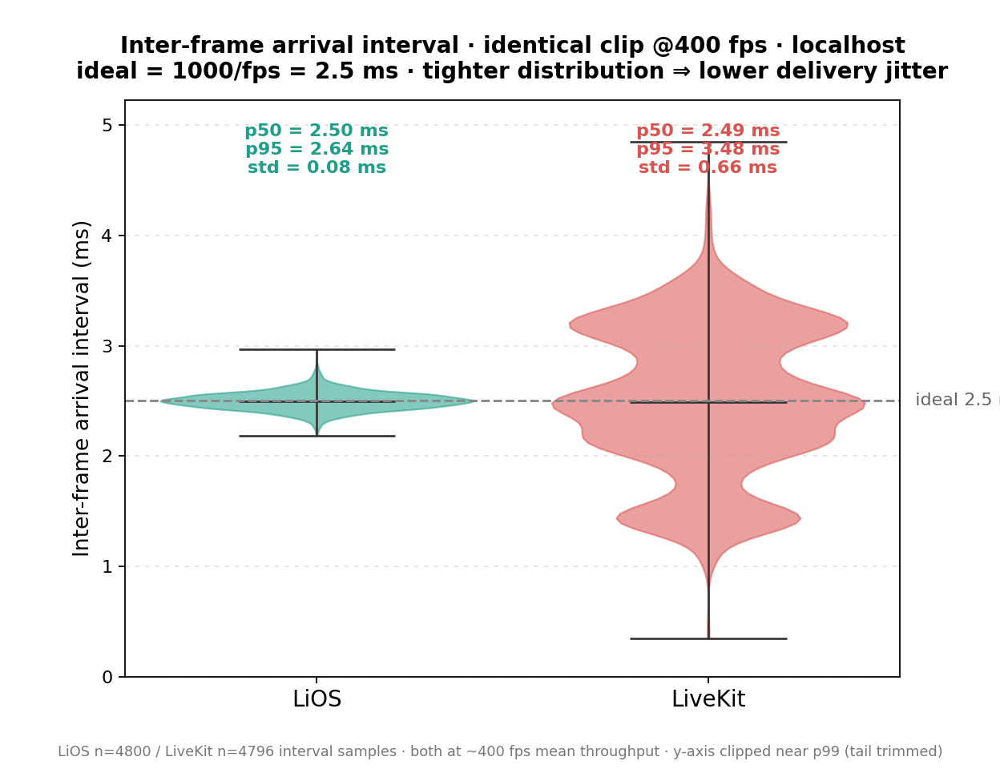

<div align="center">
  

  <h1>LiOS</h1>

  <p><em>Low-latency, GPU-accelerated edge→cloud image transport for robot inference</em></p>

  <p>
    <a href="LICENSE"></a>
    <a href="https://github.com/cmriat/LiOS/actions/workflows/ci.yml"></a>
    
    <a href="https://github.com/astral-sh/ruff"></a>
  </p>

  <p><strong>English</strong> · <a href="README.zh-CN.md">简体中文</a></p>
</div>

---

LiOS advances embodied AI from *ad-hoc system integration* toward **OS-level unified
infrastructure**, supporting the continuous iteration of robot-manipulation models across
cloud, edge, and cloud-edge collaboration. This repository is its **image-transport
component** — a **low-latency visual data path** built for *robot inference*.

Cloud-edge collaboration is the key to unlocking cloud compute: a robot in the field needs
to reach the cloud over a **low-latency, computable** data stream. Multi-camera vision,
robot state, action traces, and human-takeover signals flow into the cloud over
**WebRTC / GStreamer**, powering online inference, rollout recording, and review.

> **Unlike general-purpose real-time A/V frameworks built for *humans to watch*
> (conferencing / streaming / collaboration SDKs): a general framework's endpoint is to
> decode the picture and hand it to the application layer or a screen; LiOS's endpoint is to
> put the picture directly into the hands of a model on the GPU (VLA / Policy).**

**Why is it low-latency?** The transport is designed to keep the picture's detour into the
cloud model as short as possible:

- **Hardware GPU codec path** — edge camera → NVENC hardware encode → encrypted WebRTC
  transport → cloud NVDEC hardware decode. Encode and decode run on the GPU (NVENC/NVDEC),
  and color conversion can stay GPU-side (`nvvideoconvert`), keeping software codecs off the
  data plane.
- **Zero-copy inference buffer** — once decoded, frames are exposed to downstream as CUDA
  tensors through `InferenceBufferV2`, which shares GPU memory across processes via CUDA-IPC
  handles. Multiple consumers (model, observer, recorder) map the **same device memory with no
  extra copy**.
- **Near-net relay deployment** — the relay sits close to the cloud inference service,
  fitting lab intranets, enterprise networks, and cloud-provider VPCs; it cuts
  public-internet detours while keeping reachability.
- Together these bring end-to-end one-way latency from *local camera → cloud CUDA buffer*
  down to the **~30 ms range** (network ~24 ms) — markedly lower than general relay / public
  Cloud paths — with concurrent multi-camera upload.

Component architecture and module responsibilities: see [`design.md`](design.md).

---

## Architecture


Red nodes run on the GPU — NVENC encode, NVDEC decode, and the CUDA-tensor inference buffer
(shared zero-copy across processes via CUDA-IPC). Details in [`design.md`](design.md).

---

## Quick start

Requires NVIDIA drivers and GStreamer plugins (`nvh264enc` / `nvh264dec` / `cudaupload`).
Environment managed with [pixi](https://pixi.sh).

```bash
pixi install

# 0) configure: copy and fill in ROOM / SIGNAL_URL / STUN / TURN
cp .env.example .env   # examples auto-load .env; the default config needs no real camera

# 1) start the signaling server (Go)
cd signal-server && go build -o webrtcssvr . && ./webrtcssvr serve --addr :18080

# 2) start the sender (edge GPU). Default VIDEO_SOURCE=test uses videotestsrc (no camera).
pixi run python examples/two_cemera_sender.py

# 3) start the receiver (cloud GPU: decode → CUDA → InferenceBufferV2)
pixi run python examples/two_cemera_receiver_inferbuf.py --streams 2

# 4) watch the live preview in a browser (the receiver serves it automatically)
#    http://127.0.0.1:5082/api/v1/preview          (MJPEG stream)
#    http://127.0.0.1:5082/api/v1/preview?cam=cam0&fps=15
#    set FLASK_HOST=0.0.0.0 before step 3 to view from another machine
```

Config is read from `.env` (or the environment, which wins): `ROOM`, `SIGNAL_URL`, `STUN`,
`TURN`, plus `VIDEO_SOURCE` (`test` | `v4l2`) and `CAMERAS`. To use real cameras set
`VIDEO_SOURCE=v4l2` and `CAMERAS=mid=/dev/video0@30,left=/dev/video4@25`. Set `GST_DEBUG=4`
to debug the pipeline.

---

## Benchmarks

All comparisons use **identical content** (the same synthetic clip encoded on both sides),
**matched bitrate**, and **per-frame counting at the receiver** (a direct decoded-frame
count, not the `fpsdisplaysink` rate signal — which over-reports for this stream). Both
stacks use **NVENC/NVDEC hardware** codecs; the differences below are architectural +
deployment, not hardware-vs-software.

### Latency (deployment topology)



Camera → cloud CUDA buffer, one-way latency (bidirectional NTP method, clock offset
cancelled). This compares **each stack at its default deployment**: LiOS self-hosts an
**edge relay** you place near the robots/GPU (≈ 28 ms); LiveKit's managed **Cloud** default
routes through its PoPs (≈ 242 ms). The advantage here is the ability to control relay
placement — LiveKit never uses the LiOS relay.

### Throughput



| Condition | LiOS (NVENC/NVDEC) | LiveKit (libwebrtc) |
|---|---|---|
| Same clip · 10 Mbps · localhost | **≥ 1200 fps** (no saturation) | **≈ 600–700 fps** (saturated; subscriber stream interrupts at ≥ 1000 fps) |
| Cross-machine · 2 Mbps · each at its default deployment | **≈ 1687 fps** (edge relay, stable) | **≈ 330 fps** (Cloud, high variance 246–334) |

- LiOS's achieved frame rate tracks the target up to the measurement limit (1200 fps) with
  no saturation; its pipeline ceiling, measured separately with `videotestsrc`, is
  ≈ 1685 fps.
- LiveKit's single-stream real-time pipeline saturates near **700 fps**; the subscriber
  stream drops at ≥ 1000 fps.
- The "25 fps" sometimes attributed to such SDKs is a **misconfiguration** (publisher
  leaving `max_framerate` unset, defaulting to ~30 fps), not a hardware limit — with the
  rate configured, libwebrtc sustains 200–700 fps.

### Delivery jitter



At the same **400 fps** mean throughput, inter-frame arrival interval: LiOS **σ = 0.08 ms**
(p95 2.64), LiveKit **σ = 0.66 ms** (p95 3.48, max 5.4) — about **8× more jitter**. For VLA /
real-time control, the variance of the delivery interval matters more than the mean rate.

---

## Repository layout

| Path | Description |
|---|---|
| `src/gst_webrtc/sender/` | `WebRTCSender` (webrtcbin sendonly, gst-launch-style dynamic sources) |
| `src/gst_webrtc/receiver/` | `WebRTCReceiver` (webrtcbin recvonly, RTP-sink description strings) |
| `src/gst_webrtc/gpu_sink/` | `GpuFrameSink`: appsink → thread-safe frame queue |
| `src/gst_webrtc/inference_buffer_v2.py` | `InferenceBufferV2`: CUDA-IPC zero-copy inference buffer (posix shared memory) |
| `src/gst_webrtc/ws_signal/` | WebSocket signaling client |
| `src/gst_webrtc/services/` | State sync / control API (Flask + WebSocket JSON) |
| `signal-server/` | Go WebRTC signaling server (Cobra CLI) |
| `examples/` | Runnable two-camera sender / receiver (with inference buffer) |
| `benchmark/` | `make_figures.py` (all figures), `throughput/` (gst), `livekit/` (LiveKit), `rtp_latency/` (RTP latency probes) — see [`benchmark/README.md`](benchmark/README.md) |
| `docs/` | Experiment report and figures |

---

## Documentation

- [`design.md`](design.md) — component architecture and module responsibilities
- [`docs/gst-report/`](docs/gst-report/) — image-transport performance report (latency + throughput)
- [`AGENTS.md`](AGENTS.md) — development conventions
- [`CONTRIBUTING.md`](CONTRIBUTING.md) — dev setup, linting, tests, and PR flow

---

## License

This project is licensed under the [Apache License 2.0](LICENSE).

---

## Citation

If this project helps your research or product, please cite:

```bibtex
@software{lios,
  title  = {LiOS: GPU-accelerated edge-to-cloud video transport for robot inference},
  author = {LiOS Authors},
  year   = {2026},
  url    = {https://github.com/cmriat/LiOS}
}
```
