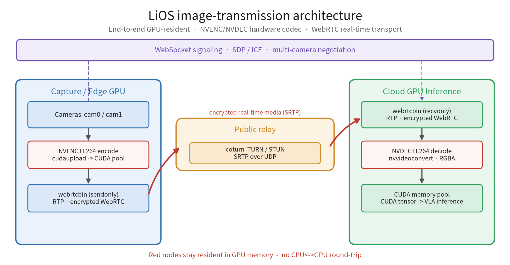

# 组件架构设计 — LiOS 图传组件

本文件描述 LiOS 图传组件的**软件组件构成**与各模块职责。数据面的物理链路（NVENC→中继→NVDEC）见下方架构图；端到端实验数据见 [`docs/gst-report/`](docs/gst-report/)。

---

## 一、组件架构图

```mermaid
%%{init: {'theme':'base','themeVariables':{'fontFamily':'-apple-system,Segoe UI,Helvetica,Arial,sans-serif','fontSize':'14px','lineColor':'#94a3b8','clusterBorder':'#cbd5e1'},'flowchart':{'curve':'basis','padding':14}}}%%
flowchart LR
    subgraph EDGE["📷 采集 / 边缘 GPU 端"]
        direction TB
        CAM["多路相机 cam0 / cam1"]
        ENC["GStreamer 管线<br/>cudaupload → nvh264enc(H.264)<br/>h264parse → rtph264pay"]
        SND["WebRTCSender<br/>(sender/core.py)<br/>webrtcbin sendonly · 动态加源"]
        CAM --> ENC --> SND
    end

    subgraph SIG["🔗 信令面 (control plane)"]
        direction TB
        SC1["ws_signal/signal_client"]
        SRV["signal-server (Go)<br/>WebSocket · 房间路由<br/>SDP / ICE 转发"]
        SC2["ws_signal/signal_client"]
        SC1 <--> SRV <--> SC2
    end

    subgraph RELAY["🌐 公网中继"]
        TURN["coturn<br/>TURN / STUN · SRTP"]
    end

    subgraph CLOUD["☁️ 云端 GPU 推理端"]
        direction TB
        RCV["WebRTCReceiver<br/>(receiver/core.py)<br/>webrtcbin recvonly · RTP sink 描述串"]
        DEC["GStreamer 管线<br/>rtph264depay → nvh264dec<br/>→ CUDA 显存"]
        SINK["GpuFrameSink<br/>(gpu_sink/core.py)<br/>appsink → 线程安全帧队列"]
        IBUF["InferenceBufferV2<br/>CUDA IPC 零拷贝缓冲<br/>(posix 共享内存)"]
        VLA["VLA / Policy 推理"]
        RCV --> DEC --> SINK --> IBUF --> VLA
    end

    subgraph SVC["🛠 状态 / 控制 API (services/)"]
        API["flask_api · ws_json_api<br/>server_suite · ws_json_client<br/>状态同步 · HIL 接管 · episode 记录"]
    end

    %% 数据面（加密媒体流）
    SND -. "实时加密媒体流 (SRTP)" .-> TURN
    TURN -. "实时加密媒体流 (SRTP)" .-> RCV

    %% 信令面
    SND -.->|SDP/ICE| SC1
    RCV -.->|SDP/ICE| SC2

    %% 控制面
    IBUF --- API
    API -.->|状态/接管| RCV

    %% ---- 子图容器配色 ----
    style EDGE  fill:#eff6ff,stroke:#3b82f6,stroke-width:1.5px,color:#1e3a8a
    style SIG   fill:#f5f3ff,stroke:#8b5cf6,stroke-width:1.5px,color:#5b21b6
    style RELAY fill:#fffbeb,stroke:#f59e0b,stroke-width:1.5px,color:#92400e
    style CLOUD fill:#ecfdf5,stroke:#10b981,stroke-width:1.5px,color:#065f46
    style SVC   fill:#f8fafc,stroke:#64748b,stroke-width:1.5px,color:#334155

    %% ---- 节点配色 ----
    classDef gpu    fill:#fee2e2,stroke:#dc2626,stroke-width:2.5px,color:#7f1d1d,font-weight:bold;
    classDef edge   fill:#dbeafe,stroke:#2563eb,stroke-width:1.5px,color:#1e3a8a;
    classDef cloud  fill:#d1fae5,stroke:#059669,stroke-width:1.5px,color:#065f46;
    classDef relay  fill:#fef3c7,stroke:#d97706,stroke-width:1.5px,color:#92400e;
    classDef sig    fill:#ede9fe,stroke:#7c3aed,stroke-width:1.5px,color:#5b21b6;
    classDef svc    fill:#e2e8f0,stroke:#475569,stroke-width:1.5px,color:#1e293b;
    class ENC,DEC,IBUF gpu;
    class CAM,SND edge;
    class RCV,SINK,VLA cloud;
    class TURN relay;
    class SC1,SRV,SC2 sig;
    class API svc;
```

> 渲染版数据面架构图：

**关键节点：** `ENC`、`DEC`、`IBUF` 三个红色节点运行在 GPU 上——`ENC` 做 NVENC 编码、`DEC` 做 NVDEC 解码、`IBUF` 以 CUDA tensor 形式保存推理缓冲。解码帧经 appsink 取出后写入 `InferenceBufferV2`，缓冲层再经 CUDA-IPC 句柄把同一块显存**零拷贝**共享给下游多个消费者（模型 / 观测 / 记录）。

---

## 二、模块职责

| 模块 | 类 / 入口 | 职责 |
|---|---|---|
| `sender/core.py` | `WebRTCSender` | 围绕 `webrtcbin (sendonly)` 的工程化发送端；以 gst-launch 风格描述串**动态添加视频源**；主导“完美协商 + ICE 重启”。 |
| `receiver/core.py` | `WebRTCReceiver` | 极简 `webrtcbin (recvonly)` 接收端；`set_rtp_sink_desc(desc)` 传入从 `application/x-rtp` 起的解码链；`pad-added` 时把 `src_%u` 接到对应 Bin；**被动** O/A 与 trickle ICE，无重连状态机。 |
| `gpu_sink/core.py` | `GpuFrameSink` | appsink 背后的帧出口，解码帧经线程安全队列交给下游；记录 pts/dts/seqnum/尺寸/格式。 |
| `inference_buffer_v2.py` | `InferenceBufferV2` | 自包含的推理输入/输出缓冲；torch CUDA tensor 经 ForkingPickler 序列化为 **CUDA IPC 句柄**，跨进程零拷贝映射同一块显存；base64 传输，元数据内嵌。 |
| `ws_signal/signal_client.py` | `SignalClient` | WebSocket 信令客户端：join/ready、收发 SDP offer/answer 与 ICE 候选。 |
| `signal-server/` | Go (Cobra CLI) | WebSocket 信令服务：房间路由、SDP/ICE 转发。构建产物 `webrtcssvr`。 |
| `services/` | `flask_api` / `ws_json_api` / `server_suite` / `ws_json_client` | 状态同步、云端观察、人工接管 (HIL) 控制链路、episode 记录接口。 |

---

## 三、关键设计决策

1. **GPU 硬件编解码 + 零拷贝缓冲。** 发送端 `cudaupload → nvh264enc`，接收端 `nvh264dec`，编解码均由 GPU 硬件完成（色彩转换可走 `nvvideoconvert` 留在 GPU 侧）；解码帧经 appsink 取出后写入 `InferenceBufferV2`，以 CUDA tensor 形态通过 CUDA-IPC 在多进程间零拷贝共享给模型。GPU 硬件编解码是高吞吐（单路 600–1700 fps）的来源。

2. **CUDA IPC 零拷贝缓冲。** `InferenceBufferV2` 用 Torch 的 CUDA IPC 句柄序列化，多个进程映射同一块显存；导出进程需保持源 tensor 存活直到所有消费者用完，否则访问未定义。

3. **gst-launch 风格描述串组合管线。** 发送端动态加源、接收端 `set_rtp_sink_desc` 都用描述串拼装，避免硬编码解码器探测与冗长动态拼接，便于多路相机与不同 codec 扩展。

4. **发送端主导、接收端被动的信令模型。** 发送端负责完美协商与 ICE 重启；接收端只被动响应 offer/候选，逻辑最小化，断联恢复靠对新 offer 的标准 O/A 答复。

5. **数据面 / 信令面 / 控制面分离。** 媒体走 WebRTC+SRTP（经中继）；信令走独立 WebSocket 服务；状态同步与 HIL 接管走 `services/` 的 JSON API，互不阻塞。

---

## 四、端到端数据流

1. 发送端与接收端各自经 `SignalClient` 连到 `signal-server`，加入同一 `ROOM`。
2. 发送端构建 GPU 编码管线，`webrtcbin` 发起 offer；信令服务转发 SDP/ICE，接收端被动答复。
3. 媒体经 coturn 中继以 SRTP 传输（或在允许直连时走 P2P）。
4. 接收端 `webrtcbin` 收到 RTP，按描述串 `rtph264depay → nvh264dec` 在 CUDA 显存中解码。
5. `GpuFrameSink` 取出解码帧，按 msid（cam0 / cam1）写入 `InferenceBufferV2.images`。
6. 模型从 `InferenceBufferV2` 读取多视角 CUDA tensor 进行推理；`services/` 同步状态、暴露观察界面、支持人工接管与 episode 记录。

---

## 相关文档

**总览**：[`README.md`](README.md)

**设计文档**
- [`docs/design/gpu-sink.md`](docs/design/gpu-sink.md) — GPU Frame Sink 设计
- [`docs/design/RESTORE_DESIGN.md`](docs/design/RESTORE_DESIGN.md) — webrtcbin 通用断流恢复策略
- [`src/gst_webrtc/receiver/DESIGN.md`](src/gst_webrtc/receiver/DESIGN.md) — 接收端精简设计
- [`src/gst_webrtc/sender/RECONNECT_DESIGN.md`](src/gst_webrtc/sender/RECONNECT_DESIGN.md) — 发送端断连恢复（落地）

**使用文档**
- [`docs/usage/gpu-sink.md`](docs/usage/gpu-sink.md) — GPU Frame Sink 用法
- [`docs/usage/inference_buffer_v2.md`](docs/usage/inference_buffer_v2.md) — InferenceBufferV2 用法

**实验报告**：[`docs/gst-report/`](docs/gst-report/) — 延迟 / 吞吐 benchmark（自包含 HTML + 图）
</content>
